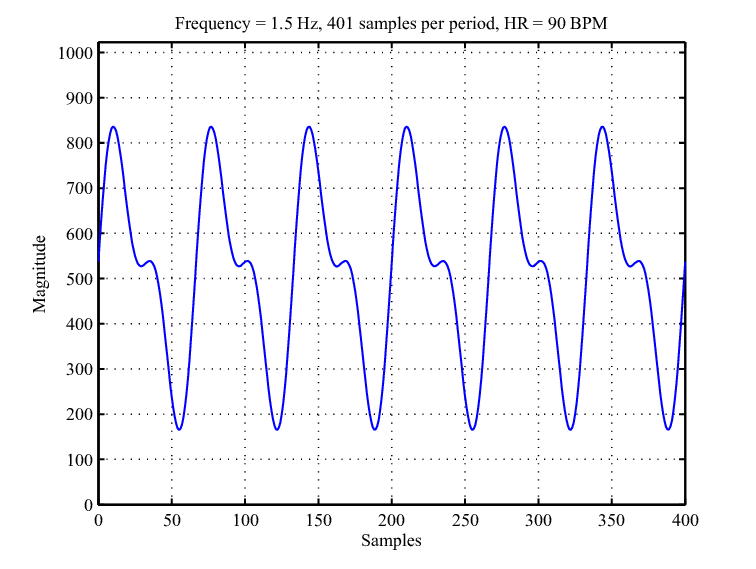

```{r setup, include=FALSE}
knitr::opts_chunk$set(echo = TRUE)
```
1. Nagłówki

# Nagłówek pierwszego stopnia

## Nagłówek drugiego stopnia

### Nagłówek trzeciego stopnia

#### Nagłówek czwartego stopnia

2. Lista
- Element 1
- Element 2
- Element 3

3. Hiperłącze

Oto hiperłącze do [Google](https://www.google.com).

4. Wykres

```{r, fig.cap = "Przykładowy wykres", echo = FALSE}
library(ggplot2)
ggplot(mtcars, aes(x = mpg, y = wt)) + geom_point()
```
5. Obrazek

Obrazek:


6. Tabela


| Nagłówek 1 | Nagłówek 2 |
|------------|------------|
| Wartość 1  | Wartość 2  |
| Wartość 3  | Wartość 4  |


7. Wstawki

Ukryta:

```{r, echo = FALSE}
x <- 1:10
y <- x
plot(x, y)
```

NIe wykonuje się:

z <- 1:5
mean(z)

Jawna:

```{r, echo = TRUE}
x <- 1:10
cat(x)
```

8. Formuła Latex

LaTeX: $E = mc^2$.

